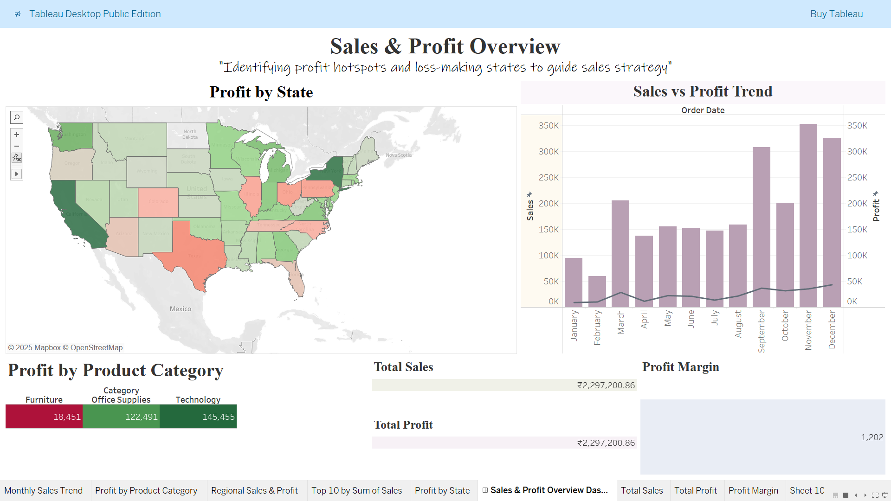

# Superstore Data Visualization & Storytelling in Tableau

## 📌 Objective
To create visualizations that convey a compelling business story using the Superstore dataset in Tableau.

## 📊 Tools Used
- Tableau Desktop
- Superstore.csv dataset

## 🛠 Steps Taken
1. **Data Cleaning**
   - Removed `###` placeholders and replaced with NULL.
   - Checked for unknown values and handled them.
2. **Visualization Design**
   - KPI Cards for Sales, Profit, Profit Margin.
   - Geographic Map for regional performance.
   - Dual-Axis Chart for Sales vs Profit trend.
   - Category Breakdown to show top-performing products.
3. **Storytelling**
   - Logical flow from KPIs → Where (map) → When (trend) → What (categories).
   - Used consistent colors, minimal clutter, and annotations for key insights.

## 📷 Screenshots

## 📂 Files in this Repository
- `dataset/Superstore.csv` → Original dataset used.
- `tableau_workbook/superstore_dashboard.twbx` → Packaged Tableau dashboard.
- `screenshots/` → Dashboard & chart visuals.
- `README.md` → Project documentation.

## ✅ Outcome
Gained experience in:
- Visual storytelling
- Business insight extraction
- Clean and clear dashboard design
